<p align="center">
  
</p>

<h1 align="center">HazeNow</h1>

<p align="center">
  <b>Your air, right now.</b><br>
  NEA's 1-hour PM2.5 reading for where you are, in plain words, on every screen you own.<br>
  Free and open source. No ads, no tracking, no account.
</p>

<p align="center">
  <a href="#get-it">Get it</a> ·
  <a href="#why-this-exists">Why</a> ·
  <a href="#how-it-works">How it works</a> ·
  <a href="#built-with-claude-tested-with-devin">Built with Claude, tested with Devin</a> ·
  <a href="#southeast-asia">Southeast Asia</a> ·
  <a href="#build-it-yourself">Build it</a>
</p>

---

## Why this exists

During a haze, most of us check the **24-hour PSI**. It is an average of the last 24 hours, so it moves slowly. When the haze rolls in fast, it can read "Moderate" while the air outside has been getting worse for hours.

On **28 September 2026** at 4pm:

| | 24-hr PSI (headline) | 1-hr PM2.5 (the last hour) |
|---|---|---|
| South | 84 · Moderate | **105 µg/m³ · Elevated** |
| West | 81 · Moderate | **117 µg/m³ · Elevated** |
| Central | 81 · Moderate | **105 µg/m³ · Elevated** |

An hour later, the South read **140**. The 24-hr PSI had barely moved.

NEA already publishes the last hour's PM2.5, and since 2016 recommends it for deciding what to do *right now*. It is just not the number people see first. HazeNow puts that number first, tells you what it means for you in one sentence, and shows the official 24-hr PSI next to it so you can always check us against NEA.

The gap runs both ways. When haze clears, the 24-hr PSI stays high for most of a day while the air is already fine. HazeNow tells you that too.

<p align="center">
  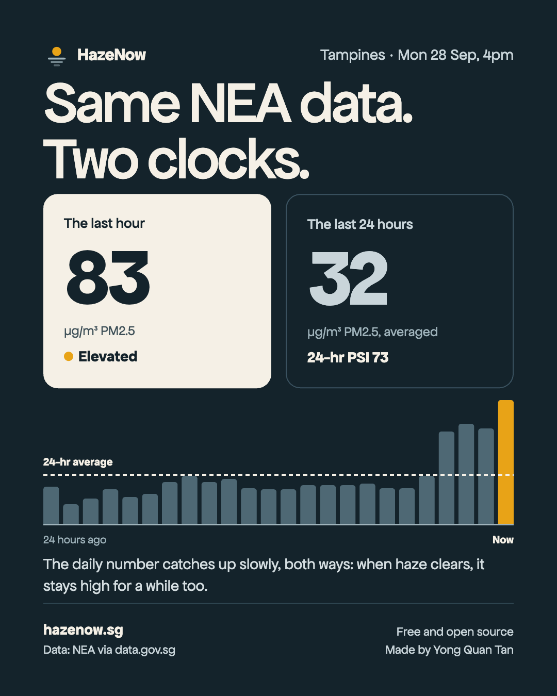
  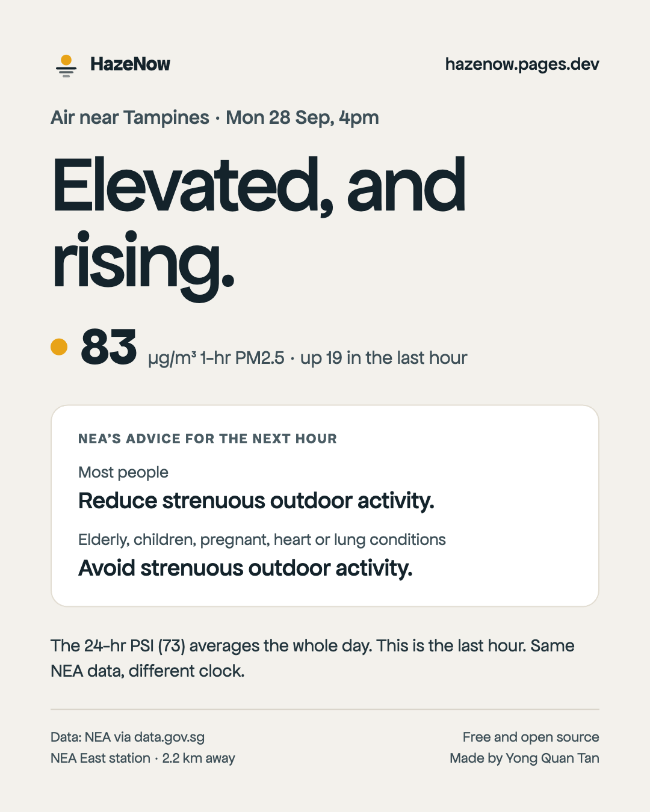
</p>

### What it is not

- **Not a new index.** We never invent an "hourly PSI". NEA declined to publish one in 2015, and showing a third label for the same air is how the 2013 confusion started. The big number is always µg/m³, with NEA's own band names.
- **Not against NEA.** Every number is NEA's, credited on every screen. We show the official PSI alongside, and explain the difference in one neutral sentence.
- **Not a scare app.** Calm colours, no flashing, no "danger". Every warning comes with something you can do, and we always send the all-clear.

## Get it

Everything is free, and nothing needs an app store. **Step-by-step guide with pictures: [hazenow.pages.dev/download](https://hazenow.pages.dev/download/)**. Every file is on [GitHub Releases](https://github.com/yongquantan/hazenow/releases), and each has a stable link that always points at the newest release: `https://github.com/yongquantan/hazenow/releases/latest/download/<file>`.

> **Heads-up while the repo is private:** GitHub only serves release files to signed-in collaborators of a private repo. The links below, the download page's buttons and Obtainium start working for everyone once releases are public: make this repo public, or set the `RELEASE_REPO` Actions variable to a public repo such as `yongquantan/hazenow-releases` (plus a `RELEASES_TOKEN` secret) and build the site with `HAZENOW_RELEASES_REPO` set to the same repo. See [Releases](#releases).

| Where | How to install | Status |
|---|---|---|
| **Web** ([`apps/web`](apps/web)) | Open [hazenow-app.pages.dev](https://hazenow-app.pages.dev). Installable, works offline | Live |
| **iPhone** | Safari → [hazenow-app.pages.dev](https://hazenow-app.pages.dev) → Share → **Add to Home Screen**. Widget: free **Scriptable** app + [`HazeNow-scriptable.js`](https://github.com/yongquantan/hazenow/releases/latest/download/HazeNow-scriptable.js). The native app ([`apps/apple`](apps/apple)) needs a paid Apple account, so it isn't distributed | Available |
| **Android** ([`apps/android`](apps/android)) | [`HazeNow-android.apk`](https://github.com/yongquantan/hazenow/releases/latest/download/HazeNow-android.apk). Updates: [Obtainium](https://github.com/ImranR98/Obtainium) | Available |
| **Mac** ([`apps/apple`](apps/apple)) | [`HazeNow-mac.zip`](https://github.com/yongquantan/hazenow/releases/latest/download/HazeNow-mac.zip): menu bar `● 105 ▲`, notch pill | Available (not notarised) |
| **SwiftBar / xbar** ([`integrations/swiftbar`](integrations/swiftbar)) | [`hazenow.2m.py`](https://github.com/yongquantan/hazenow/releases/latest/download/hazenow.2m.py) in your plugin folder | Available |
| **Command line** ([`packages/core`](packages/core)) | `npm i -g https://github.com/yongquantan/hazenow/releases/latest/download/hazenow-cli.tgz` | Available |
| **Home Assistant** ([`integrations/home-assistant`](integrations/home-assistant)) | [`hazenow-home-assistant.zip`](https://github.com/yongquantan/hazenow/releases/latest/download/hazenow-home-assistant.zip), or HACS | Available |
| **Raycast** ([`integrations/raycast`](integrations/raycast)) | Menu bar command and a "Haze Now" view | Coming soon |
| **Telegram bot** ([`integrations/telegram-bot`](integrations/telegram-bot)) | `/now`, share your location, band-change alerts | Coming soon |

### iPhone
1. Open [hazenow-app.pages.dev](https://hazenow-app.pages.dev) in **Safari**.
2. Tap **Share** (the square with an arrow pointing up; on iOS 26, tap **•••** first), then **Add to Home Screen**, then **Add**.
3. For a Home Screen or Lock Screen widget: install **Scriptable** (free, App Store), open [`HazeNow-scriptable.js`](https://github.com/yongquantan/hazenow/releases/latest/download/HazeNow-scriptable.js), copy it into a new Scriptable script named **HazeNow**, then long-press your Home Screen → **+** → Scriptable → **Add Widget**, tap the widget and pick **Script: HazeNow**.

### Android
1. Download [`HazeNow-android.apk`](https://github.com/yongquantan/hazenow/releases/latest/download/HazeNow-android.apk) and open it.
2. The first time, Android asks to allow your browser to **install unknown apps**. Allow it once, go back, and tap **Install**.
3. Optional, for automatic updates: install [Obtainium](https://github.com/ImranR98/Obtainium), then open `obtainium://add/https://github.com/yongquantan/hazenow` (or paste `https://github.com/yongquantan/hazenow` into Obtainium's **Add app**). Obtainium watches GitHub Releases and offers each new APK.

Google's Android developer verification starts in Singapore on 30 Sep 2026: on certified devices, an APK from an unregistered developer needs Android's extra "advanced" install steps (or `adb`). If Android shows an extra safety check for apps from outside an app store, follow its steps. Registering HazeNow's package with Google (free limited-distribution account, or full verification) would remove that step.

The APK is signed with HazeNow's own key (certificate SHA-256 `e7:4c:5f:e9:b9:28:9b:08:5e:14:57:6d:99:0d:03:6e:3a:fd:c2:c7:d7:56:e0:1b:13:30:6c:1b:55:2d:58:d0`), so updates install over the top.

### Mac
1. Download [`HazeNow-mac.zip`](https://github.com/yongquantan/hazenow/releases/latest/download/HazeNow-mac.zip), double-click to unzip, and drag **HazeNow** into **Applications**.
2. Open it. macOS says **"HazeNow" Not Opened** ("Apple could not verify "HazeNow" is free of malware…"), because HazeNow is free and isn't registered with Apple ($99/year). Click **Done**.
3. Open **System Settings → Privacy & Security**, scroll down to **Security**, and next to **"HazeNow" was blocked to protect your Mac** click **Open Anyway**. Confirm **Open Anyway** and enter your password. The button appears for about an hour after you tried to open the app. From then on it opens normally.

No warning at all: install [SwiftBar](https://swiftbar.app) (`brew install --cask swiftbar`), then put [`hazenow.2m.py`](https://github.com/yongquantan/hazenow/releases/latest/download/hazenow.2m.py) in its plugin folder and `chmod +x` it.

### Command line
```sh
npm i -g https://github.com/yongquantan/hazenow/releases/latest/download/hazenow-cli.tgz   # Node 18+
hazenow            # the full reading
hazenow --oneline  # ● 105 ▲ for tmux, starship or your prompt
```

### Home Assistant
- **HACS:** ⋮ → **Custom repositories** → add the integration's repository (type **Integration**) → install → restart → **Settings → Devices & services → Add → HazeNow**. HACS needs the integration at a repository root, so this works once `integrations/home-assistant` is published as its own public repo (see its [README](integrations/home-assistant/README.md)).
- **Manual:** download [`hazenow-home-assistant.zip`](https://github.com/yongquantan/hazenow/releases/latest/download/hazenow-home-assistant.zip) and unzip it into your config folder, so you get `config/custom_components/hazenow`. Restart.

Check any download against `SHA256SUMS.txt` on the release: `shasum -a 256 -c SHA256SUMS.txt --ignore-missing`.

<p align="center">
  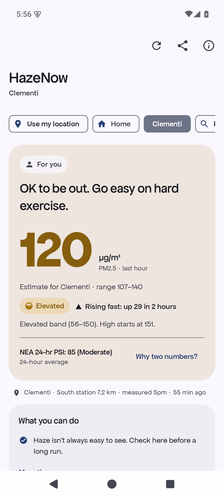
  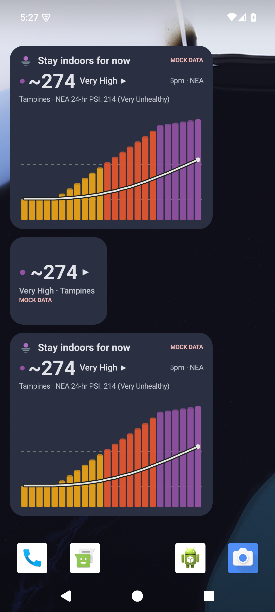
  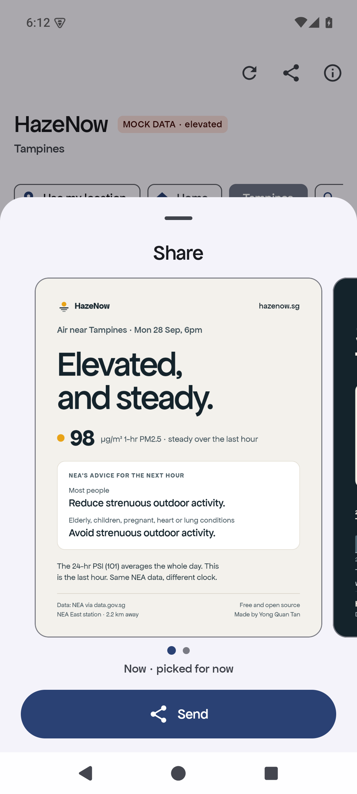
</p>

## How it works

**One question, answered first.** The person opening HazeNow is usually worried and asking *"Is it OK for me, or my kid, to be outside right now?"* So every screen leads with a verdict ("OK to be out. Go easy on hard exercise."), then the number, then where it came from ("NEA East station · 2.2 km · measured 5pm"), then one to three things you can do.

**Data: NEA only.** Two public data.gov.sg endpoints, merged per hour, no key needed:

- `api.data.gov.sg/v1/environment/pm25` is first to publish, about a minute after the hour.
- `api-open.data.gov.sg/v2/real-time/api/pm25` fills gaps, for example when a station is missing from v1.

Apps check once a minute from the top of the hour until the new reading lands, then go quiet. If NEA rate-limits us, apps back off and show the last reading with its real age. An offline station is explained in words, never shown as `-1`. We never fall back to a weather model: during this haze, a popular model read 32.6 when NEA read 105.

**Your spot, not just your region.** NEA reports five regions. HazeNow estimates your spot by weighting the nearby stations by distance, and shows a range when stations disagree. You can use your location (approximate only, it never leaves your phone) or pick your area from 55 towns and 217 estate names, searched offline.

**Advice that fits the person.** Say who you're checking for (kids, elderly, pregnant, heart or lung condition, exercising, working outdoors) and the advice follows NEA's stricter guidance for that group. Masks follow the Ministry of Health: never the first suggestion, and never N95s for children.

**Alerts that earn trust.** A message only when the band changes. Healthy adults don't get "Elevated" alerts by default. At most three rise alerts a day, quiet from 10pm to 7am, and always an all-clear.

**Built to be shared.** One tap on **Share** sends the right card for the moment: the image, a short message and the link. Every card prints the date, time, area, NEA credit and who made it, so a forwarded card can always be checked.

<p align="center">
  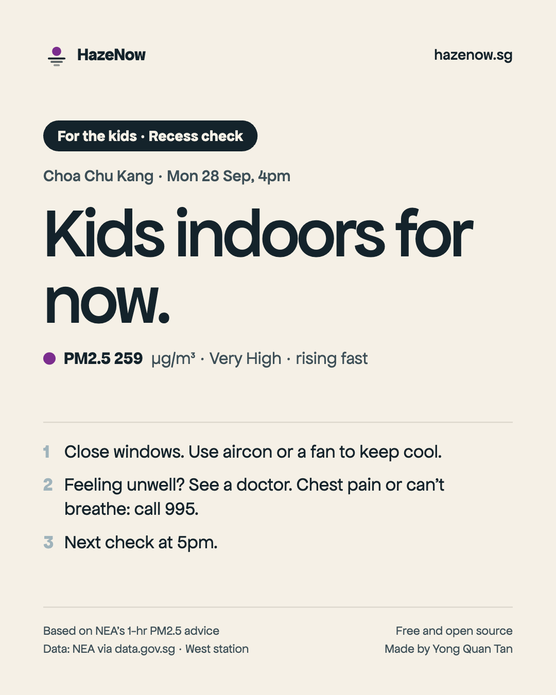
  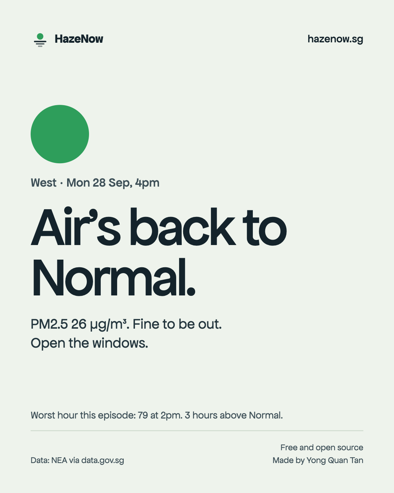
  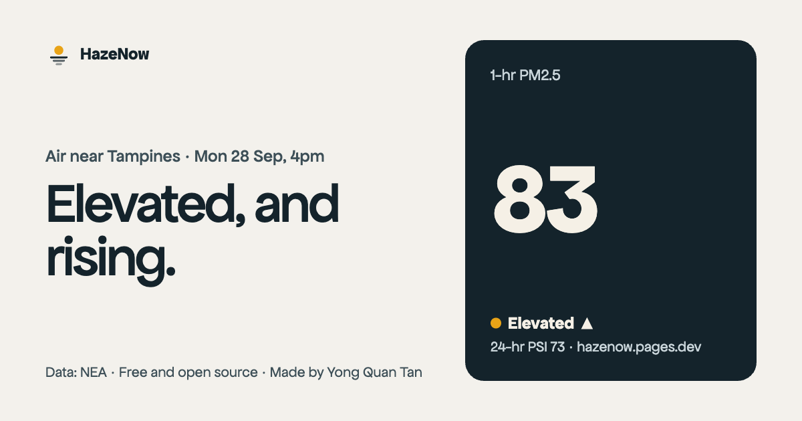
</p>

| Card | Sent when | For |
|---|---|---|
| **Now** | Default, and whenever the band is Elevated or higher | Family and class chats |
| **For our group** | You've picked a group (kids, elderly, runners and so on) and the air is Elevated or higher | Parents, caregivers, run clubs |
| **Two clocks** | The hour and the 24-hr average disagree a lot, in either direction | Anyone asking "why don't the numbers match?" |
| **All clear** | The air is back to Normal after an episode | Everyone. Good news is the easiest thing to share |

The full product rules live in [`SPEC.md`](SPEC.md). Every word on every screen lives in [`docs/COPY.md`](docs/COPY.md).

## Built with Claude, tested with Devin

HazeNow went from a Facebook post about the PSI to four platforms, eight integrations and a Southeast Asia plan in one working session. Claude built it. Devin tested it.

### Built with Claude Code

One Claude Code session led, and handed work to parallel agents that each owned one part of the repo:

- **Research:** NEA's publishing delay (measured minute by minute), every other data source for Singapore, the DIY sensor option, and a checked set of NEA and MOH health advice.
- **Behavioural design:** risk communication research, the "verdict first, number second" rule, the decision to drop the invented "Instant PSI", and every word in `docs/COPY.md`.
- **Sharing:** how people in Singapore are actually talking about the haze, where they share (mostly private WhatsApp groups), and the card set that came out of it.
- **Builders:** the TypeScript core and web app, the Apple apps, the Android app, and the integrations. They all worked from the same [`SPEC.md`](SPEC.md), so the verdict, the numbers and the share cards match on every platform.
- **Southeast Asia:** five agents checking each country's government and crowd-sensor data live, in parallel.

The spec grew in versions as findings came in (v1.0 to v1.7), and every change went out to every builder at once. When one platform found a better rule, like Android's fix to the estimate range, it became a spec change and the others followed.

### Tested with Devin

When the builds were green, Claude pushed the repo and started four [Devin](https://devin.ai) sessions through the Devin API. Each ran on its own machine: two macOS machines (iOS Simulator, and the Mac app) and two Linux machines (an Android emulator, and a browser). Each built the app from a clean checkout and walked the same 16 scenarios in [`docs/QA_MATRIX.md`](docs/QA_MATRIX.md): live data, every band, a station offline, stale data, network errors, every health profile, location allowed and denied, dark mode, screen readers, sharing and widgets. Each recorded its screen and labelled every checkpoint. Each came back with a structured report of bugs.

**Round 1, on v0.1:** 96 checks, 34 recordings and 18 bugs across the four platforms. Every bug went back to the agent that owned that code. The biggest ones: the official PSI sat below the fold, the installed web app hung on its first offline launch, and the largest text sizes broke the layout on iPhone and Android.

<p align="center">
  <a href="docs/qa/round-1/four-platforms.mp4">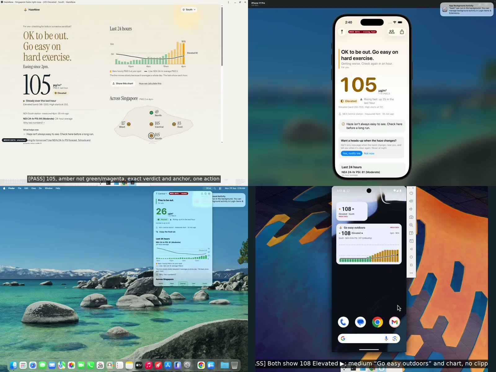</a><br>
  <sub>Four machines, one live reading. Web, iPhone, Mac and Android, tested at the same time. Click to play.</sub>
</p>

| | | |
|---|---|---|
| [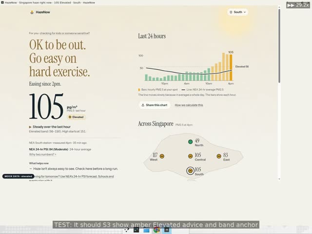](docs/qa/round-1/web-bands.mp4)<br>**Web:** every band, checked against the exact wording | [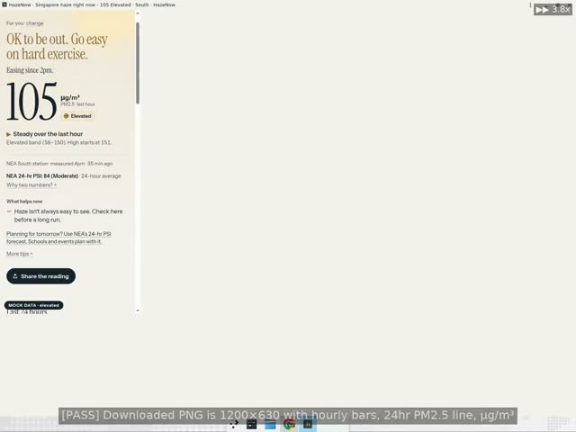](docs/qa/round-1/web-share.mp4)<br>**Web:** share, embed and copy | [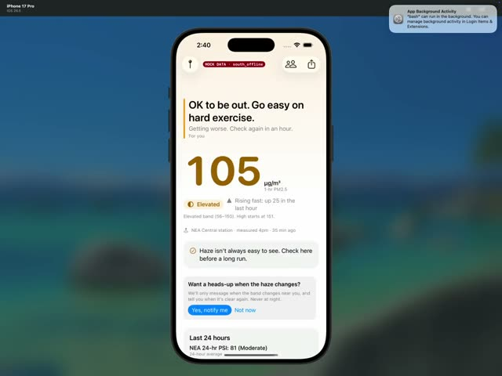](docs/qa/round-1/ios-states.mp4)<br>**iPhone:** offline station, stale data, rising fast |
| [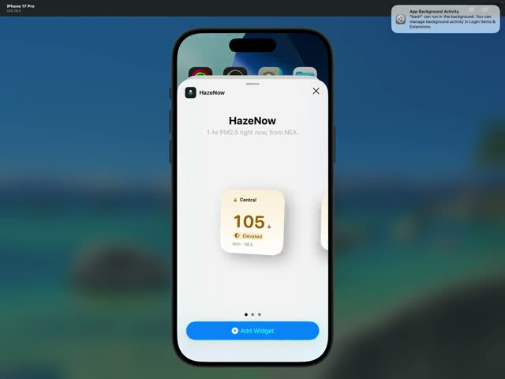](docs/qa/round-1/ios-widgets-live-activity.mp4)<br>**iPhone:** widgets, Lock Screen and Live Activity | [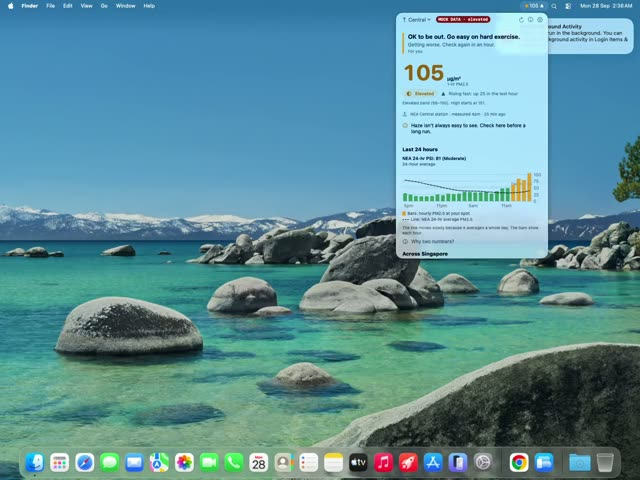](docs/qa/round-1/mac-menu-bar.mp4)<br>**Mac:** menu bar reading and popover | [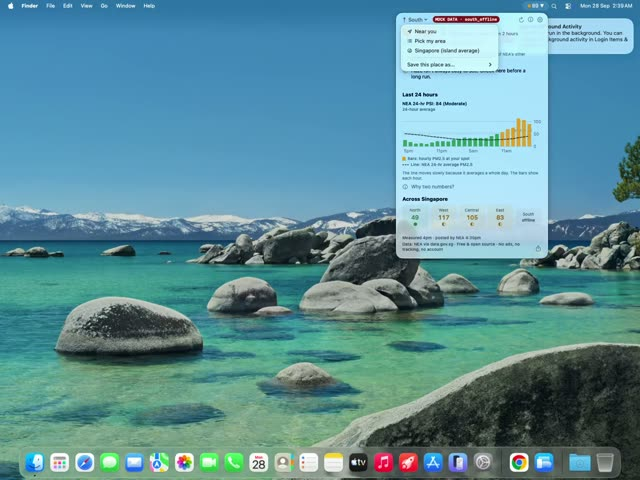](docs/qa/round-1/mac-edge-states.mp4)<br>**Mac:** edge states |
| [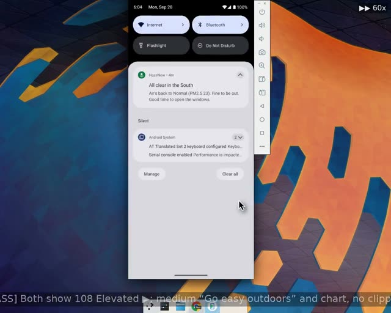](docs/qa/round-1/android-widgets-tile.mp4)<br>**Android:** widgets and Quick Settings tile | [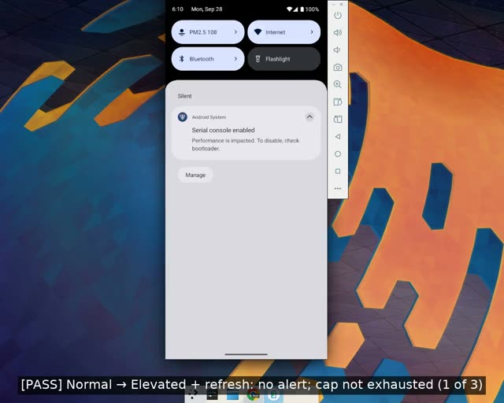](docs/qa/round-1/android-band-alerts.mp4)<br>**Android:** band-change alerts and the all-clear | [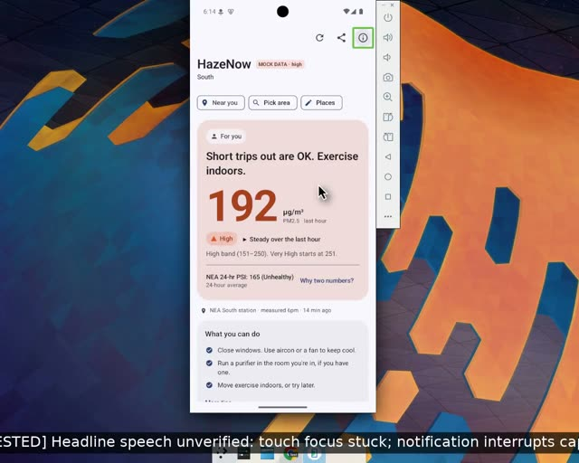](docs/qa/round-1/android-talkback.mp4)<br>**Android:** TalkBack screen reader |

These recordings are of v0.1, before the new font, the share cards and the fixes from this round. Round 2 re-runs the same scenarios on the current version.

Re-run QA yourself (needs a Devin API key):

```sh
DEVIN_API_KEY=… DEVIN_ORG_ID=… scripts/devin-qa.sh launch          # one session per surface
scripts/devin-qa.sh report <session-id>                              # structured bug report
scripts/devin-qa-recordings.sh web:<session-id> ios:<session-id>     # every recording, with timestamped labels
```

## Southeast Asia

Haze doesn't stop at borders, so we checked what "right now" data exists across the region. The big number stays µg/m³ everywhere, labelled with each country's own category words, so we never contradict the local authority.

| Country | Official hourly data | Crowd sensors | Status |
|---|---|---|---|
| Singapore | NEA 1-hr PM2.5 | 14 | **Live** |
| Thailand | Air4Thai 1-hr PM2.5, 173 stations (68 in Bangkok) | 124 AirGradient, 546 DustBoy | **Next** |
| Malaysia | 24-hr index only, 68 stations | 8 | Needs our server and permission |
| Indonesia | BMKG hourly PM2.5, mostly in the fire zones | 12 in Palembang, about 62 in Greater Jakarta | Needs our server and permission |
| Vietnam | Hanoi only | 3 | Hanoi via our server |
| Philippines | Blocked | 22 | Metro Manila, crowd sensors only |
| Laos | None | 103 | Crowd sensors only |
| Cambodia, Myanmar, Brunei | None usable | 1 to 3 | Not yet |

Research per country: [`docs/sea/`](docs/sea). The city-by-city list and the to-do list for every city we can't cover yet: [`docs/sea/COVERAGE.md`](docs/sea/COVERAGE.md).

## Build it yourself

```
SPEC.md                  the product rules every client follows
packages/core            TypeScript core + CLI (npm: hazenow)
apps/web                 web app (Vite)
apps/apple               HazeKit (Swift package) + iPhone app + Mac app + widgets
apps/android             Kotlin + Jetpack Compose + Glance widgets
integrations/            SwiftBar, Raycast, Home Assistant, Telegram, Scriptable, shell
brand/                   logo, icons, Apfel Grotezk (SIL OFL)
docs/                    research, copy, sharing, QA matrix, Southeast Asia
```

```sh
# Core, CLI and web
npm install
npm test                        # core tests
npm run dev                     # web app on localhost
node packages/core/dist/cli.js  # after npm run build

# Apple (Xcode 26+)
cd apps/apple/HazeKit && swift test
cd apps/apple && xcodegen generate && open HazeNow.xcodeproj

# Android (JDK 17)
cd apps/android && ./gradlew :core:test assembleDebug
```

Every app has a mock mode for testing any air state without waiting for haze. For example, `?mock=high` on the web, `-HazeMock high` on Apple, and `am start … --es mock high` on Android. See each app's README.

## Releases

`.github/workflows/release.yml` builds every file above and publishes a GitHub Release with the same file names each time:

- **Push a tag** `vX.Y.Z` (a tag with `-`, like `v0.3.0-rc1`, becomes a prerelease), or run **Release** from the Actions tab (workflow_dispatch; tag optional, prerelease and draft toggles).
- **Monthly:** on the 1st, if `main` has changed since the last tag, it bumps the patch, tags and releases.
- Files: `HazeNow-android.apk` (signed), `HazeNow-mac.zip` (ad-hoc signed, built on `macos-26` with Xcode 26.3; optional, since macOS minutes count 10x), `hazenow-cli.tgz`, `HazeNow-scriptable.js`, `hazenow.2m.py`, `hazenow-home-assistant.zip` and `SHA256SUMS.txt`. The notes list the commits since the last tag, plus how to install.
- If the Mac job fails or is skipped, `scripts/release-mac-local.sh [tag]` builds the zip on a Mac and uploads it with `gh release upload`.
- **Where releases go:** one switch. By default they go to this repo. Set the Actions variable `RELEASE_REPO` (e.g. `yongquantan/hazenow-releases`) and a `RELEASES_TOKEN` secret (fine-grained PAT, Contents: read and write on that repo) to publish elsewhere. Build the site with `HAZENOW_RELEASES_REPO` set to the same repo.
- `releases/latest/download/…` skips prereleases and drafts, so release candidates never replace what people download.
- **Android signing:** secrets `ANDROID_KEYSTORE_BASE64`, `ANDROID_KEYSTORE_PASSWORD` and `ANDROID_KEY_ALIAS`. Gradle reads them from the environment (`HAZENOW_KEYSTORE_FILE`, `HAZENOW_KEYSTORE_PASSWORD`, `HAZENOW_KEY_ALIAS`); without them, local release builds stay unsigned, as before. **Keep an offline backup of the keystore and its password.** If it's lost, installed apps can't be updated, and everyone has to uninstall and reinstall.
- **Web and site** are on Cloudflare Pages (`hazenow-app` and `hazenow` projects). `scripts/deploy-pages.sh` builds and deploys both. The release workflow also redeploys them after a full release when a `CLOUDFLARE_API_TOKEN` secret (Cloudflare Pages: Edit) and `CLOUDFLARE_ACCOUNT_ID` exist.
- **CI** (`.github/workflows/ci.yml`) runs on every push and PR, on Linux only: core tests, web and site builds, proxy tests, Android `:core:test assembleDebug` and the Home Assistant tests.

## Docs

| | |
|---|---|
| [`SPEC.md`](SPEC.md) | Product rules, data, bands, verdicts, location, sharing |
| [`docs/COPY.md`](docs/COPY.md) | Every word on every screen |
| [`docs/UX_PSYCHOLOGY.md`](docs/UX_PSYCHOLOGY.md) | The research behind the calm, verdict-first design |
| [`docs/SHARING.md`](docs/SHARING.md) | How people share haze information, and why the cards look the way they do |
| [`docs/DATA_SOURCES.md`](docs/DATA_SOURCES.md) | Every Singapore data source, tested live |
| [`docs/QA_MATRIX.md`](docs/QA_MATRIX.md) | The scenarios every platform is tested against |
| [`docs/DISTRIBUTION.md`](docs/DISTRIBUTION.md) | Launch plan |
| [`docs/sea/`](docs/sea) | Southeast Asia research and coverage |

## Credits

Made by **Yong Quan Tan** · [LinkedIn](https://www.linkedin.com/in/yongquantan) · I run [Kairos Labs](https://kairoslabs.sg), an applied AI studio.

Data: NEA via [data.gov.sg](https://data.gov.sg), under the Singapore Open Data Licence. HazeNow is not affiliated with NEA.
Typeface: [Apfel Grotezk](https://www.collletttivo.it/typefaces/apfel-grotezk) by Collletttivo, under the SIL Open Font License.
Code: [MIT](LICENSE).

HazeNow gives general information from public data. It is not medical advice. If you feel unwell, see a doctor. For chest pain or difficulty breathing, call 995.
