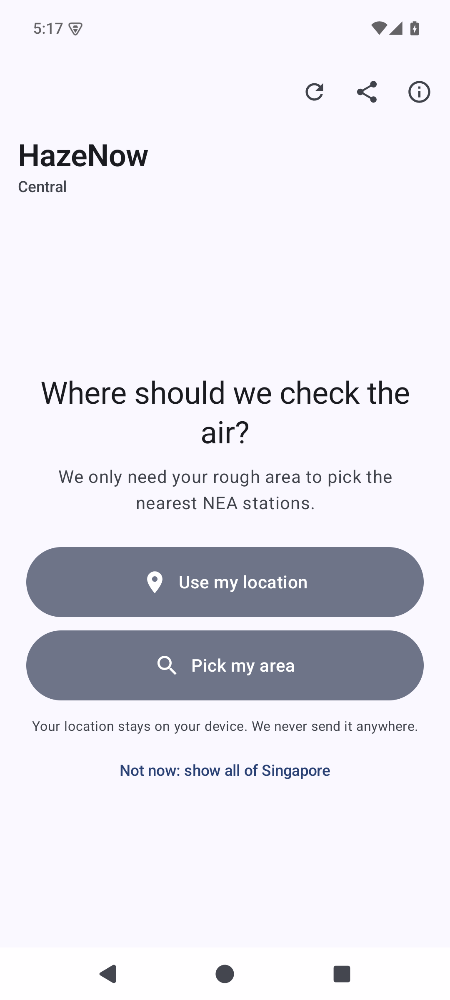
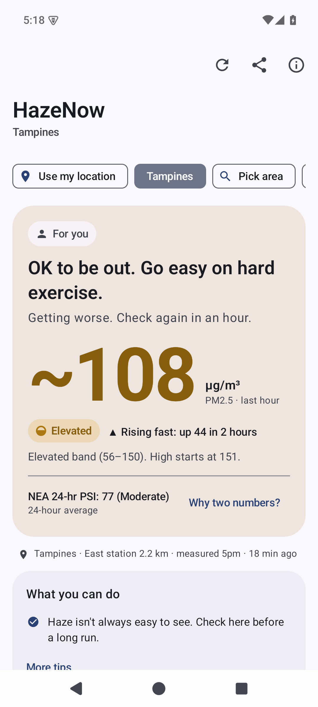
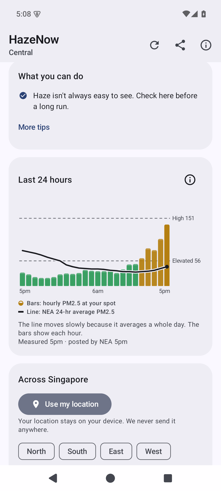
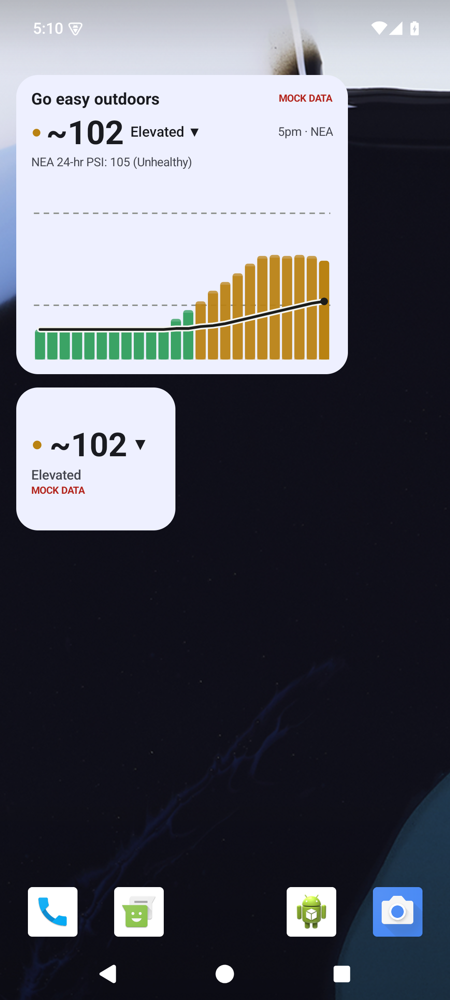

# HazeNow for Android

> Is it OK to be outside right now? A plain answer first, then the 1-hr PM2.5 number.

HazeNow is a Kotlin and Jetpack Compose app. Its package is `sg.hazenow`, with minSdk 26 and targetSdk 35. It follows [`/SPEC.md`](../../SPEC.md) through v1.4, and all of its wording comes from [`/docs/COPY.md`](../../docs/COPY.md).

Every number comes from NEA via data.gov.sg. There is no backend, no API key, no account, no ads and no tracking. Your location never leaves the device.

   

## What it shows

**Main screen.** The order follows SPEC v1.1 with the v1.2 changes:

1. A place switcher: Near you, Home, Work/School, Other, the area you picked, "Pick area" and "Places".
2. The verdict for your profile, e.g. "For you + kids". Only the verdict is a TalkBack live region.
3. The big 1-hr PM2.5 number, prefixed with `~` when it is blended from stations. A "Nearby stations read lo–hi" line appears when the reading is uncertain.
4. The band chip. It carries both a shape and a label: a circle, a half gauge, a triangle or an octagon.
5. The trend in words, a line showing where you sit in the band, and "NEA 24-hr PSI: 81 (Moderate)" with "Why two numbers?".
6. Where the reading comes from, by mode: "Near you · West station 3.2 km", "Tampines · East station 2.2 km" or "Singapore (island average)".
7. Up to 3 actions, filtered by profile. A mask is never the first action and kids never get the N95 action. "More tips" holds the rest.
8. "Last 24 hours": hourly PM2.5 bars, with NEA's `pm25_twenty_four_hourly` drawn as a line in the same unit (µg/m³). The chart has dashed guides at 56 and 151.
9. The regions list, the notification settings and the footer.

Instant PSI is **not shown anywhere**, per SPEC v1.2 §1. The core module still computes `instantPsi` for JSON users.

**Everything else:**
- **Profiles:** General, Kids, Older adults, Pregnant, Asthma/COPD/heart, Exercising outdoors and Works outdoors. They are multi-select, and the strictest verdict wins. They are stored in DataStore on the device.
- **Share:** the COPY §15 text (no verdict) plus a PNG card of the chart.
- **Widgets (Glance):**
  - The small widget shows `● 105 ▲` and the band word.
  - The medium widget is resizable. It shows the short verdict, `105 Elevated ▲`, "5pm · NEA", the place, the NEA 24-hr PSI and the chart.
  - Each widget can be pinned to a place (Home, Work/School, …) through an optional configuration screen.
- **Quick Settings tile:** "PM2.5 105 / Elevated ▲", with the number drawn as the icon.
- **Haze watch:** an optional, silent, ongoing notification. Its status-bar icon is the number.
- **Band alerts (COPY §11):**
  - Alerts fire only on band crossings. A crossing counts after 2 hours across the boundary, or once the reading is ≥10 µg/m³ past it.
  - Elevated alerts are off by default for the General-only profile.
  - The limit is 3 alerts a day, but the all-clear is always sent.
  - Quiet hours are 22:00–07:00, followed by a morning catch-up.
- **Accessibility:** colours are only accents, adjusted until text reaches ≥4.5:1 contrast and icons ≥3:1 (`core/Contrast`). Band colours are never mixed together. Every important element has a TalkBack label.

## Brand (brand/README.md)

- **Launcher icon:** an adaptive icon made only of vector drawables, with no raster icons (minSdk 26 supports adaptive icons, so no legacy PNG fallback is needed).
  - The background is Ink `#14232B`.
  - The foreground is `brand/svg/mark-on-dark.svg` scaled into the 66 dp safe zone of the 108 dp canvas (`ic_launcher_foreground.xml`).
  - A `<monochrome>` layer supports Android 13+ themed icons.
- **Notification and QS tile icon:** `brand/svg/mark-small-template.svg` as a white vector (`ic_stat_haze.xml`). Haze watch keeps the live number as its status-bar icon.
- **Medium widget header:** the mark, with its dot in the band colour. On dark backgrounds Very High uses `#B06BC4`. The haze lines never change (`ChartPainter.markBitmap`).
- Screenshot: `docs/screenshots/icon.png`.

## Data and refresh (SPEC v1.3)

- **v1** `api.data.gov.sg/v1/environment/{pm25,psi}` is the primary source, because it has the freshest data. It publishes about 1 minute after the hour.
- **v2** `api-open.data.gov.sg/v2/real-time/api/{pm25,psi}` fills in gaps. It is rate limited and returns HTTP 429 `{"code":24}`.
- The two are merged per hour and region: use the v2 value if it's valid, otherwise the v1 value, otherwise treat it as missing. `publishedAt` is v1's `update_timestamp`.
- **Foreground polling (`Freshness.plan`):** from hh:00:30, poll v1 every 60 s until the new hour appears, stopping at hh:10. Then call v2 once at about hh:35 and about hh:50 to catch back-fills, and stay idle otherwise.
- No endpoint is called more than once a minute. On a 429 or a network error the app backs off exponentially from 30 s to 10 min and honours `Retry-After`.
- **Background:** WorkManager runs a periodic job every 15 min (Android's minimum) and a best-effort one-off at hh:02 that re-arms itself. Both need a network connection. Each run updates the widgets, tile, Haze watch and alerts.

## Location (SPEC v1.4)

- **First run** offers two equal choices, and the OS permission prompt only appears after a tap.
  - **"Use my location"** shows a one-line explainer first. It then asks for `ACCESS_COARSE_LOCATION` only, in the foreground only.
  - **"Pick my area"** opens an offline, searchable list of the 55 URA planning areas and their aliases. The list is copied at build time from `packages/core/data/sg-areas.json`, so searching never touches the network.
- **If permission is denied**, the app never asks again on its own. It falls back to the area list, then to the island average. A quiet "Use my location" chip lets the user try again: tapping it asks again if Android still allows that, and otherwise opens the app's Settings page.
- **Coordinates** are rounded to 2 decimals (about 1 km) before they are stored, and they are never logged.
- **Location provider:** the platform `LocationManager` (fused provider on API 31+, then network, then GPS). There is **no Google Play Services dependency**.

## Build

You need JDK 17 and the Android SDK (platform 35, build-tools 35.0.0). Gradle comes from the wrapper (8.11.1).

```sh
# macOS / Homebrew (what this repo was built with)
brew install openjdk@17 && brew install --cask android-commandlinetools
export JAVA_HOME=/opt/homebrew/opt/openjdk@17/libexec/openjdk.jdk/Contents/Home
export ANDROID_HOME=/opt/homebrew/share/android-commandlinetools
yes | sdkmanager --licenses
sdkmanager "platform-tools" "platforms;android-35" "build-tools;35.0.0"
# Linux: any JDK 17 + the cmdline-tools zip from developer.android.com; same sdkmanager line.

cd apps/android
echo "sdk.dir=$ANDROID_HOME" > local.properties

./gradlew :core:test        # pure-JVM tests: SPEC vectors, -1 handling, v1/v2 merge, cadence, COPY strings, alerts, areas
./gradlew assembleDebug     # app/build/outputs/apk/debug/app-debug.apk  (id sg.hazenow, mock mode enabled)
./gradlew assembleRelease   # R8-minified; unsigned unless keystore.properties exists
./gradlew bundleRelease     # AAB for Play
```

The app has no native code, so the same APK runs on arm64 and x86_64 emulators and devices.

## QA with adb

All of these commands work on a debug build. Only the `mock`, `DEBUG_*` and `resetFirstRun` hooks are debug-only; the other `am start` extras work in any build.

```sh
adb install -r app/build/outputs/apk/debug/app-debug.apk
adb shell pm grant sg.hazenow android.permission.POST_NOTIFICATIONS            # Android 13+
adb shell am start -n sg.hazenow/.MainActivity                                  # launch (activity-alias)
```

**First run and places:**
```sh
adb shell pm clear sg.hazenow                                   # fresh install state -> first-run screen
adb shell am start -n sg.hazenow/.MainActivity --ez resetFirstRun true   # (debug) show first run again
adb shell am start -n sg.hazenow/.MainActivity --es area Tampines        # pick an area (skips first run)
adb shell am start -n sg.hazenow/.MainActivity --ez island true          # island average
adb shell am start -n sg.hazenow/.MainActivity --es region west          # a single NEA station
adb shell am start -n sg.hazenow/.MainActivity --es place home           # switch to a saved place
```

**Deterministic mock data (debug builds only).** The scenario is saved to DataStore, so the widgets, tile and notifications use it too. A red **MOCK DATA** badge is shown whenever it is active.
```sh
adb shell am start -n sg.hazenow/.MainActivity --es mock <scenario>   # or: --es mock off
#   normal | elevated | high | very_high | south_offline | all_offline_stale | rising_fast | network_error
adb shell am broadcast -a sg.hazenow.DEBUG_MOCK -p sg.hazenow --es mock high   # same, without opening the app
```
- The fixtures are in raw NEA response shape, in `app/src/debug/assets/mock/<scenario>/{pm25,psi}.json`. They are generated by `tools/gen_mock_fixtures.py`, which copies `packages/core/fixtures/scenarios/<scenario>/` instead if that folder exists.
- Values are fixed. Timestamps are shifted so the newest hour is the current hour.
- `south_offline` is best checked with `--es region south`.
- An alert test sequence: `normal`, then `high` (gives "Haze now High in the …"), then `normal` (gives "All clear in the …").

**Force a refresh of every surface now** (debug). This runs the refresh in-process and also enqueues the WorkManager job:
```sh
adb shell am broadcast -a sg.hazenow.DEBUG_REFRESH -p sg.hazenow
adb logcat -s HazeNowDebug          # "refresh: pm25=192 band=high"
# Any build: run WorkManager jobs through JobScheduler
adb shell cmd jobscheduler run -f sg.hazenow 0   # job ids: adb shell dumpsys jobscheduler | grep sg.hazenow
```

**Widgets.** Stock launchers can't place widgets from adb, but the app can ask the launcher to add one. This opens the system "Add to home screen" dialog; tap Add, or use `adb shell input tap` on the ADD button.
```sh
adb shell am start -n sg.hazenow/.MainActivity --es pinWidget small     # or medium
```
To add one by hand: long-press the home screen, choose Widgets, then HazeNow. Either widget can be pinned to a saved place through its settings (long-press the widget and choose ✎).

**Quick Settings tile:**
```sh
adb shell cmd statusbar add-tile sg.hazenow/sg.hazenow.tile.HazeTileService    # Android 13+
adb shell am start -n sg.hazenow/.MainActivity --ez addTile true               # or: system "add tile" dialog
adb shell cmd statusbar expand-settings
```

**Fake location.** Note that `geo fix` takes longitude first:
```sh
adb shell pm grant sg.hazenow android.permission.ACCESS_COARSE_LOCATION
adb emu geo fix 103.944 1.354          # Tampines
adb shell am start -n sg.hazenow/.MainActivity --ez location true
adb emu geo fix 103.76 1.35735         # between West and Central -> "~" and "Nearby stations read …"
```

**Screenshots:** `adb exec-out screencap -p > screen.png`

### Emulator
```sh
sdkmanager "emulator" "system-images;android-35;default;x86_64"      # arm64-v8a on Apple Silicon
avdmanager create avd -n hazenow35 -k "system-images;android-35;default;x86_64" -d pixel_7
$ANDROID_HOME/emulator/emulator -avd hazenow35 -no-window -no-audio -gpu swiftshader_indirect &
adb wait-for-device; until [ "$(adb shell getprop sys.boot_completed | tr -d '\r')" = 1 ]; do sleep 2; done
```

## Release

To sign release builds, create `apps/android/keystore.properties`. The file is git-ignored.
```
storeFile=/abs/path/hazenow-release.jks
storePassword=...
keyAlias=hazenow
keyPassword=...
```
Bump `versionCode` and `versionName` in `app/build.gradle.kts` for every release.

### F-Droid
- The app has no proprietary dependencies: no Play Services, Firebase, analytics or crash reporting. It uses only AndroidX, Kotlin, kotlinx and OkHttp from Google Maven and Maven Central, all under Apache-2.0.
- `dependenciesInfo { includeInApk = false; includeInBundle = false }` removes the Google-encrypted dependency blob.
- **Mock data and the debug receiver are debug-only.** They live in `src/debug/` and are not in release APKs.
- **Reproducible builds:**
  - Gradle comes from the checked-in wrapper, and every plugin and library version is pinned in `gradle/libs.versions.toml`, with no dynamic versions.
  - `BuildConfig` contains no timestamps or git hashes.
  - Build with JDK 17 from a clean checkout of a tag such as `android-vX.Y.Z`. Sign with `apksigner`, using v2/v3 signatures, and check the result with `apksigcopier`.
  - The build reads `../../packages/core/data/sg-areas.json`, so build from the repository checkout, not from `apps/android` alone.
- Metadata sketch (`fdroiddata/metadata/sg.hazenow.yml`):
  ```yaml
  Categories: [Science & Education]
  License: MIT
  AutoUpdateMode: Version android-v%v
  UpdateCheckMode: Tags ^android-v.*$
  Builds:
    - versionName: 1.0.0
      versionCode: 1
      commit: android-v1.0.0
      subdir: apps/android/app
      gradle: [yes]
  ```
- There are no anti-features. The app only uses the network to reach data.gov.sg. Store text and screenshots can go under `fastlane/metadata/android/en-US/`.

### Google Play
- Upload the AAB from `bundleRelease` and use Play App Signing.
- **Data safety:** no data is collected or shared. Approximate location is processed on the device only and stored rounded to about 1 km.
- **Permissions:**
  - `ACCESS_COARSE_LOCATION` (optional, foreground only)
  - `POST_NOTIFICATIONS` (optional)
  - `INTERNET` and `ACCESS_NETWORK_STATE`
- There is no background location: the worker only reads the last known fix.
- Keep the store listing calm and factual: say you complement NEA, and make no medical claims.

## Layout

```
apps/android/
  core/   (pure Kotlin/JVM)  Model, Api (v1+v2 DTOs), HazeCore (IDW/bands/trend/merge), Experience (COPY strings,
          verdicts, actions, provenance), Alerts (+Contrast), Freshness (poll plan/backoff), Places (areas), Format
          tests: HazeCoreTest, ExperienceTest (+AlertsTest), FreshnessTest, PlacesTest; fixtures from /packages/core/fixtures
  app/src/main/java/sg/hazenow/
    data/    HazeRepository (OkHttp, v1/v2 merge, rate limit, cache), Settings (DataStore, places), LocationHelper,
             AreaList, MockData
    ui/      MainActivity (+QA extras), HazeViewModel, HazeScreen, PlacesUi (first run, picker, switcher), Theme, Share
    render/  ChartPainter (one chart for screen, widget and share card; number icon)
    widget/  Glance small + medium, WidgetConfigActivity (pin a place)
    notify/  Haze watch + band alerts;   tile/  Quick Settings tile;   work/  RefreshWorker
  app/src/debug/  DebugReceiver + mock scenario assets
  tools/gen_mock_fixtures.py
```

MIT licensed.
